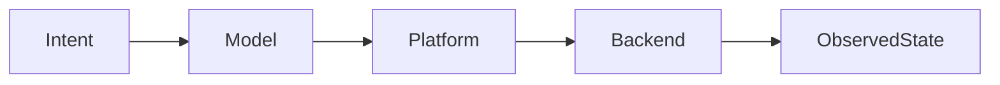

# <Task name>

Status: planned
Owner: <role or agent>
Roadmap/source: <document and checkbox>

## Objective

State the externally observable outcome and explicit non-goals.

## Baseline audit

- [ ] Current source contracts inspected.
- [ ] Existing tests and CI jobs mapped.
- [ ] Documentation and package metadata checked.
- [ ] Platform and privilege assumptions recorded.

## Decisions required

- [ ] <Decision; link the ADR when accepted.>

## Work breakdown

### Model

- [ ] <Bounded task, files, API impact, evidence.>

### Platform and facade

- [ ] <Bounded task, files, API impact, evidence.>

### Native backends

- [ ] <Linux/Windows/macOS tasks and limitations.>

### Tests and CI

- [ ] <Ordinary and privileged test matrix.>

### Documentation and packaging

- [ ] <Rustdoc, crate READMEs, root EN/RU docs, policies, manifests.>

## Integration flow

## Verification gates

- [ ] `cargo fmt --all -- --check`
- [ ] `cargo test --workspace --all-features`
- [ ] `cargo clippy --workspace --all-targets --all-features -- -D warnings`
- [ ] `cargo doc --workspace --all-features --no-deps`
- [ ] Affected `cargo package -p <crate> --allow-dirty --list`
- [ ] `git diff --check`
- [ ] Documentation audit recorded in `AUDIT.md`

## Acceptance criteria

- [ ] Behavior, tests, docs, package contents, and audit evidence agree.
